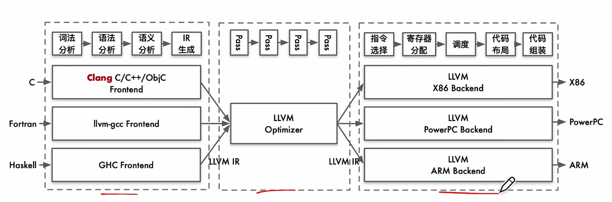

> **说明**：本文档记录学习时的知识片段，没有整合。感觉这部分知识太散了。
编译器很抽象，本质就是抽象。
```
#记录缩写
llvm 现在非缩写
ISA = Instruction Set Architecture（指令集架构）
```
Module
├── GlobalVariable（全局变量）
├── GlobalVariable  
├── Function  
│   ├── BasicBlock  
│   │   ├── Instruction  
│   │   └── Instruction  
│   └── BasicBlock  
│       └── Instruction  
└── Function  
    └── ...  

module是IR的基本单位。terminator是终结语句，是结束基本块的标志。多个基本块组成一个function。instruction是组成IR的最小单元。
为什么要基本块：高级语言内部语序混乱（相对于编译器），goto可以任意跳转，也会因为ifelse而跳转至其他位置。而基本块只有单出口单入口，块内顺序执行，以terminator结束，块间用图算法处理。

汇编器：把汇编语言翻译成机器码供处理器执行。并不是gcc用gcc的汇编器，llvm用llvm的汇编器。实际上是要翻译成哪个指令集，就选用面向哪个指令集的汇编器。如下图右半部分。
  

链接器：首先每个.o文件会记录全局变量全局函数和未定义函数。下方是用nm查看的一个.o文件的输出。
```bash
0000000000000000 D a #全局变量
0000000000000000 T add #全局函数
0000000000000000 B b #全局变量未定义
0000000000000014 T main #地址偏移20
                 U printf #未定义函数
0000000000000000 D s

```
源码里在函数中定义的变量不会出现。.o文件会对内容进行分类为不同section，大致有.text代码段，.data已初始化数据段，.rodata只读数据段，.bss未初始化数据段。上方main和add函数都在.text数据段，且main函数在add之后，所以它的地址从0x14开始，且add占有20字节长度。   
链接器把各目标文件中同名的 section 合并成连续段，再按链接脚本分配虚拟地址。这就是段合并。在这之后进行重定向，处理先前未解析的符号，如上方的printf。printf函数体在c语言库中，重定向时会在库和其他目标文件查找定义，找到后把地址写入引用处。

SSA:1. 三地址指令
    2.寄存器数量无限制
每个变量更新的时候都有新名字。有利于编译器掌握每一次值的变化过程。循环的时候不会每次循环都定义新变量，只要从静态代码看，没有两条语句指定同一个ssa名字。
SSA构造：1.找leader，构造CFG；2.构造支配边界；根据支配边界确定PHI函数插入位置；4重命名变量。

SSA析构：PHI并行，lostcopy

BasicBLock的划分：找leader指令，每个leader指令到下一个leader指令前一条指令为一个基本块。leader指令符合三条规则之一：1.全部指令序列的第一条；2.跳转语句的目标语句；3.跳转语句的下一条语句。划分出basicblock后，由于基本块的结尾可能是跳转、返回，或顺序进入下一个基本块，每个基本块之间的关系也因此确定。根据跳转指令和^顺序后继^将每个基本块用有向边连接起来，可以得到CFG


误解：AOT先全编译好再执行，JOT边编译边执行。这导致我认为AOT是编译器，JIT是解释器。其实AOT和JIT都是编译器，而解释器和编译器则是“程序如何被执行”这个实现方式层面上的概念。


1. IR（Intermediate Representation，中间表示）是一个总称，不是某一种固定语言，不同编译器、不同阶段都可以有自己的 IR，例如 LLVM IR、GIMPLE、RTL、Machine IR。
2. 总体规律是：越靠前的 IR 越接近源代码，越靠后的 IR 越接近具体机器。大致流程可以理解为：源码 → 高层 IR → LLVM IR → Machine IR → 汇编 → 机器码。
3. LLVM IR 主要位于前端输出和中端优化阶段，后端入口也会接收 LLVM IR，但随后会逐渐 lowering 成更机器相关的表示。
4. 中端优化前后通常仍然是同一种 LLVM IR，只是经过 Pass 后内容被修改、简化或优化。
6. IR 不一定必须有文本语法。LLVM IR 虽然有 `%3 = add i32 %1, %2` 这样的文本形式，但 LLVM 内部实际操作的是 Module、Function、BasicBlock、Instruction、Value 等对象。
7.IR遵循SSA


